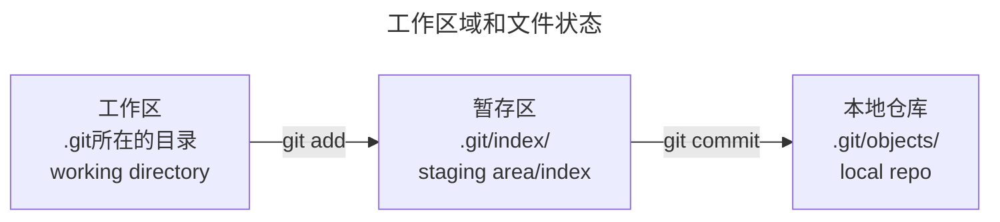

初始化
全局配置`--global`

```sh
> git config --global user.name "lux5"
> git config --global user.email lu.comer@gmail.com
> git config --global credential.helper store
> git config --global --list
```

创建一个仓库

```sh
> cd <dir>
> git init
# Or
> git init <dir>
```



`git status -s`	查看仓库的状态, `-s`以简略模式显示

`git add`	添加到暂存区

`git commit`	提交（仅限于暂存区的文件，而不是工作区里的文件）

`git log --oneline`	查看提交记录（`--oneline`参数来查看简介的提交记录）

`git ls-files`	查看暂存区的内容，文件列表

撤销，或是回退到之前的版本`git reset <version 1>`
`git reset --soft`
`git reset --hard`
`git reset --mixed`，默认！工作区的内容得以保留，暂存区的内容清除！

`git diff`	查看工作区和暂存区文件的差异
`git diff HEAD~ HEAD`  或`git diff HEAD^ HEAD`	查看当前版本和上一个提交版本的差异
`git diff HEAD~2 HEAD`	查看当前版本和上两个提交版本的差异
`git diff HEAD~2 HEAD <filename>`	查看当前文件`<filename>`版本和上两个提交版本的差异

从版本库中删除文件
1. 可以本地工作区中删除文件，然后提交
2. `git rm <filename>`	这个直接同时从工作区和暂存区删掉了文件`<filename>`！然后切记再重新提交！

应该忽略哪些文件?
```sh
# 将需要被忽略的文件添加到文件.gitignore中
> echo 需要被忽略的文件名 > .gitignore
```
注意：`.gitignore`不能对已经添加到版本库中的文件生效！

关于删除文件：
如果只想删除版本库中的文件，而不像删除本地文件，则：
`git rm --cache <filename>`

忽略非空文件夹`tmp`，这里的文件夹要以`/`结尾！
`> echo 'tmp/' >> .gitignore`